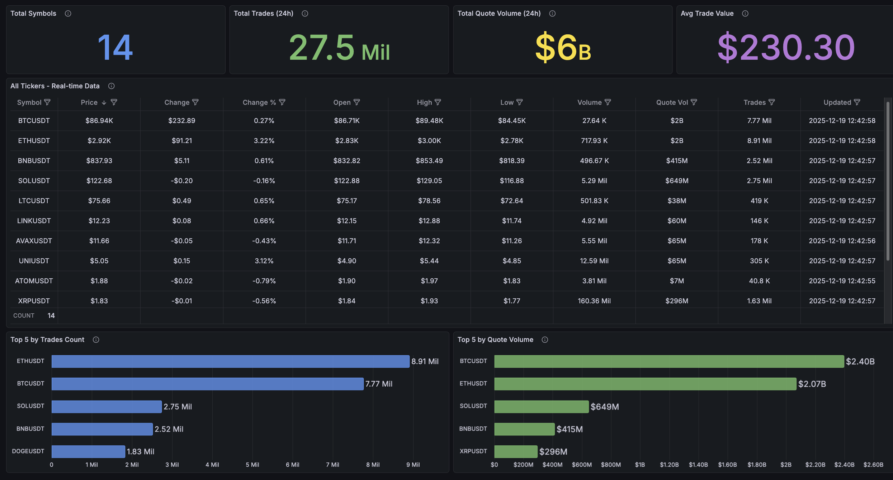
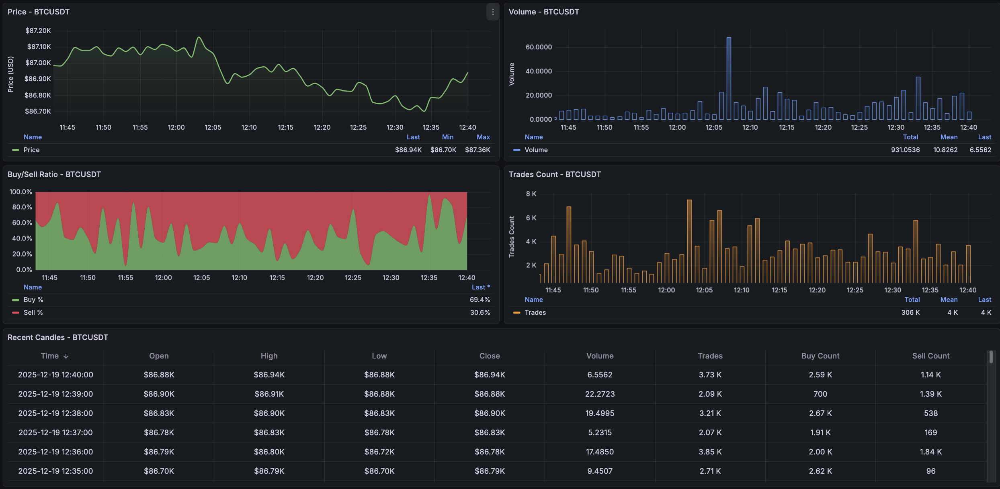
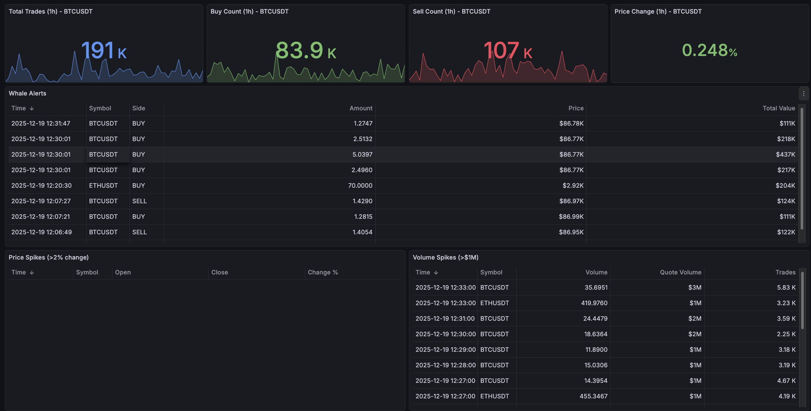
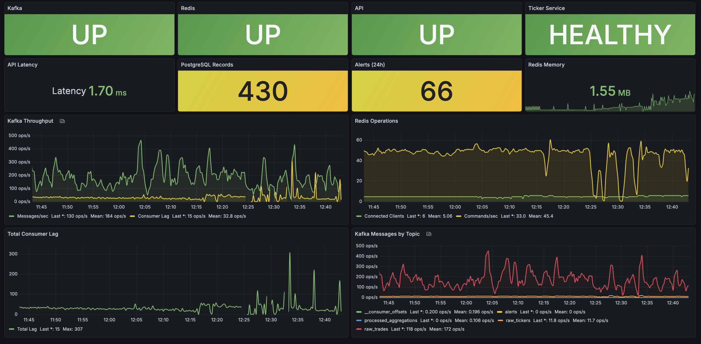
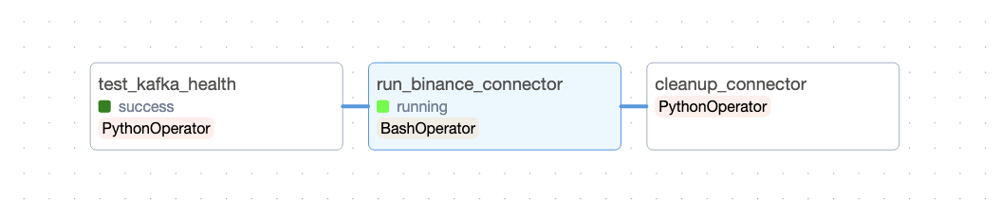
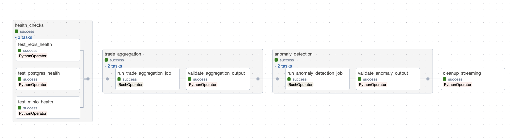

# Real-Time Cryptocurrency Data Pipeline

A production-grade data engineering project that ingests, processes, and visualizes real-time cryptocurrency market data from Binance. Built with modern streaming technologies and a three-tier storage architecture for optimal query performance across different time ranges.

## Table of Contents

- [Overview](#overview)
- [Architecture](#architecture)
- [Tech Stack](#tech-stack)
- [Features](#features)
- [Storage Architecture](#storage-architecture)
- [Project Structure](#project-structure)
- [Getting Started](#getting-started)
- [API Endpoints](#api-endpoints)
- [Monitoring and Dashboards](#monitoring-and-dashboards)
- [Airflow DAGs](#airflow-dags)
- [Configuration](#configuration)
- [Testing](#testing)

## Overview

This project demonstrates a complete real-time data pipeline that:

1. Connects to Binance WebSocket API to receive live trade and ticker data
2. Streams data through Apache Kafka for reliable message delivery
3. Processes data using Apache Spark Structured Streaming for aggregations and anomaly detection
4. Stores data in a three-tier architecture (Redis, PostgreSQL, MinIO) optimized for different query patterns
5. Exposes data through a FastAPI REST API with automatic tier routing
6. Visualizes metrics and data through Grafana dashboards
7. Orchestrates all workflows using Apache Airflow

## Architecture


The system follows an event-driven architecture with the following components:

- **Data Ingestion Layer**: Binance WebSocket connector pushes real-time data to Kafka
- **Stream Processing Layer**: Spark Structured Streaming jobs consume from Kafka, compute aggregations, and detect anomalies
- **Storage Layer**: Three-tier storage with automatic data lifecycle management
- **API Layer**: FastAPI service with intelligent query routing based on time range
- **Orchestration Layer**: Airflow manages all pipeline workflows and health checks
- **Monitoring Layer**: Prometheus metrics with Grafana dashboards

## Tech Stack

| Component | Technology | Purpose |
|-----------|------------|---------|
| Message Broker | Apache Kafka | Real-time event streaming |
| Stream Processing | Apache Spark (PySpark) | Trade aggregation, anomaly detection |
| Hot Storage | Redis | Real-time data (< 1 hour) |
| Warm Storage | PostgreSQL | Interactive analytics (< 90 days) |
| Cold Storage | MinIO (S3-compatible) | Historical archive (> 90 days) |
| API Framework | FastAPI | REST API with OpenAPI docs |
| Orchestration | Apache Airflow | Workflow management |
| Monitoring | Prometheus + Grafana | Metrics and visualization |
| Containerization | Docker Compose | Local development and deployment |

## Features

### Real-Time Data Ingestion
- WebSocket connection to Binance with automatic reconnection
- Support for multiple trading pairs (15+ symbols by default)
- Trade and ticker data streams
- Message enrichment with ingestion timestamps

### Stream Processing
- 1-minute OHLCV (Open, High, Low, Close, Volume) candle aggregation
- Derived metrics: VWAP, price change percentage, buy/sell ratio
- Real-time anomaly detection:
  - Whale alerts (trades > $100,000)
  - Volume spikes (quote volume > $1M)
  - Price spikes (> 2% change in 1 minute)

### Three-Tier Storage
- **Redis (Hot)**: Sub-millisecond access for real-time data
- **PostgreSQL (Warm)**: SQL queries for 90-day analytics
- **MinIO (Cold)**: Parquet files for historical analysis
- Automatic data lifecycle management with daily cleanup jobs

### REST API
- Automatic query routing based on time range
- Multi-timeframe klines (1m, 5m, 15m intervals)
- Rate limiting (100 requests/minute)
- Prometheus metrics endpoint
- OpenAPI documentation

### Monitoring
- Pre-configured Grafana dashboards
- System health monitoring
- Trading analytics visualization
- Real-time market overview

## Storage Architecture

| Tier | Storage | Retention | Use Case | Query Latency |
|------|---------|-----------|----------|---------------|
| Hot | Redis | 1 hour | Real-time dashboards | < 1ms |
| Warm | PostgreSQL | 90 days | Interactive analytics | < 100ms |
| Cold | MinIO (Parquet) | 365+ days | Historical analysis | < 1s |

The `QueryRouter` automatically selects the appropriate storage tier based on the requested time range.

## Project Structure

```
.
├── dags/                          # Airflow DAG definitions
│   ├── binance_connector_dag.py   # WebSocket connector orchestration
│   └── streaming_processing_dag.py # Spark jobs orchestration
├── src/
│   ├── api/
│   │   └── app.py                 # FastAPI application
│   ├── binance_kafka_connector/
│   │   └── connector.py           # Binance WebSocket client
│   ├── storage/
│   │   ├── redis.py               # Redis storage operations
│   │   ├── postgres.py            # PostgreSQL storage operations
│   │   ├── minio.py               # MinIO storage operations
│   │   ├── storage_writer.py      # Multi-tier write coordinator
│   │   ├── query_router.py        # Automatic tier selection
│   │   └── lifecycle.py           # Data lifecycle management
│   ├── streaming/
│   │   ├── base_spark_job.py      # Base class for Spark jobs
│   │   ├── trade_aggregation_job.py # OHLCV aggregation
│   │   └── anomaly_detection_job.py # Alert generation
│   ├── ticker_consumer/
│   │   └── consumer.py            # Kafka to Redis ticker consumer
│   ├── utils/
│   │   ├── config.py              # Configuration management
│   │   ├── kafka.py               # Kafka utilities
│   │   ├── logging.py             # Structured logging
│   │   ├── metrics.py             # Prometheus metrics
│   │   └── retry.py               # Retry with backoff
│   └── validators/
│       └── job_validators.py      # Output validation
├── grafana/
│   ├── dashboards/                # Pre-configured dashboards
│   └── provisioning/              # Auto-provisioning config
├── config/
│   └── prometheus.yml             # Prometheus configuration
├── tests/                         # Test suite
├── docker-compose.yml             # Container orchestration
├── Dockerfile                     # Multi-purpose container image
└── requirements.txt               # Python dependencies
```

## Getting Started

### Prerequisites

- Docker and Docker Compose
- 8GB+ RAM recommended
- Python 3.11+ (for local development)

### Quick Start

1. Clone the repository:
```bash
git clone https://github.com/lechihoang/binance-market-streaming-pipeline.git
cd binance-market-streaming-pipeline
```

2. Copy environment configuration:
```bash
cp .env.example .env
```

3. Start all services:
```bash
docker-compose up -d
```

4. Wait for services to initialize (approximately 2-3 minutes)

5. Access the services:
   - Airflow UI: http://localhost:8080 (admin/admin)
   - Grafana: http://localhost:3000 (admin/admin)
   - API Docs: http://localhost:8000/docs
   - MinIO Console: http://localhost:9001 (minioadmin/minioadmin)

6. Enable the Airflow DAGs:
   - `binance_connector_dag` - Start data ingestion
   - `streaming_processing_dag` - Start stream processing

### Stopping Services

```bash
docker-compose down
```

To remove all data volumes:
```bash
docker-compose down -v
```

## API Endpoints

### Market Data
| Endpoint | Description |
|----------|-------------|
| `GET /api/v1/market/realtime` | All real-time ticker data |
| `GET /api/v1/market/summary` | Market summary statistics |
| `GET /api/v1/market/ticker-health` | Ticker service health |
| `GET /api/v1/market/top-by-trades` | Top symbols by trade count |
| `GET /api/v1/market/top-by-volume` | Top symbols by volume |

### Analytics
| Endpoint | Description |
|----------|-------------|
| `GET /api/v1/analytics/klines/{symbol}` | OHLCV candles (1m, 5m, 15m) |
| `GET /api/v1/analytics/trades-count` | Trade count aggregations |

### Alerts
| Endpoint | Description |
|----------|-------------|
| `GET /api/v1/analytics/alerts/whale-alerts` | Large trade alerts |

### System
| Endpoint | Description |
|----------|-------------|
| `GET /api/v1/system/health` | System health status |
| `GET /metrics` | Prometheus metrics |

## Monitoring and Dashboards

### Pre-configured Dashboards

#### 1. Market Overview
Real-time prices, volumes, and market summary across all trading pairs.



#### 2. Symbol Deep Dive
Detailed analysis for individual trading pairs with OHLCV charts and trade metrics.



#### 3. Trading Analytics
Trade patterns, whale alerts, price spikes, and volume anomalies.



#### 4. System Health
Infrastructure monitoring, service status, and performance metrics.



### Metrics Collected

- Message processing rates and latencies
- Storage tier write success/failure rates
- Kafka consumer lag
- Redis memory usage
- API request rates and response times

## Airflow DAGs

| DAG | Schedule | Description |
|-----|----------|-------------|
| `binance_connector_dag` | Manual trigger | Runs WebSocket connector for data ingestion |
| `streaming_processing_dag` | Every 5 minutes | Executes Spark streaming jobs |

### 1. Binance Connector DAG

Manages the WebSocket connection to Binance API for real-time data ingestion. Runs continuously to stream trade and ticker data to Kafka topics.

**Tasks:**
- `check_kafka_health`: Verify Kafka broker connectivity
- `run_binance_connector`: Start WebSocket client for trade/ticker streams
- `run_ticker_consumer`: Consume ticker data from Kafka to Redis



### 2. Streaming Processing DAG

Orchestrates Spark streaming jobs for data processing. Runs every 5 minutes to aggregate trades and detect anomalies.

**Tasks:**
- `health_checks`: Verify Redis, PostgreSQL, and MinIO connectivity
- `trade_aggregation`: Compute 1-minute OHLCV candles with buy/sell metrics
- `anomaly_detection`: Detect whale trades, price spikes, and volume anomalies
- `cleanup_streaming`: Clean up resources after processing



## Configuration

Key environment variables (see `.env.example` for full list):

```bash
# Kafka
KAFKA_BOOTSTRAP_SERVERS=kafka:29092

# Redis (Hot Path)
REDIS_HOST=redis
REDIS_PORT=6379

# PostgreSQL (Warm Path)
POSTGRES_HOST=postgres-data
POSTGRES_PORT=5432
POSTGRES_USER=crypto
POSTGRES_PASSWORD=crypto
POSTGRES_DB=crypto_data

# MinIO (Cold Path)
MINIO_ENDPOINT=minio:9000
MINIO_ACCESS_KEY=minioadmin
MINIO_SECRET_KEY=minioadmin
MINIO_BUCKET=crypto-data

# Trading Pairs
TICKER_SYMBOLS=BTCUSDT,ETHUSDT,BNBUSDT,...
```

## Testing

Run the test suite:

```bash
# Install dependencies
pip install -r requirements.txt

# Run all tests
pytest tests/

# Run with coverage
pytest tests/ --cov=src --cov-report=html
```

Test categories:
- Unit tests for storage operations
- Integration tests for API endpoints
- Property-based tests using Hypothesis
- End-to-end pipeline tests


